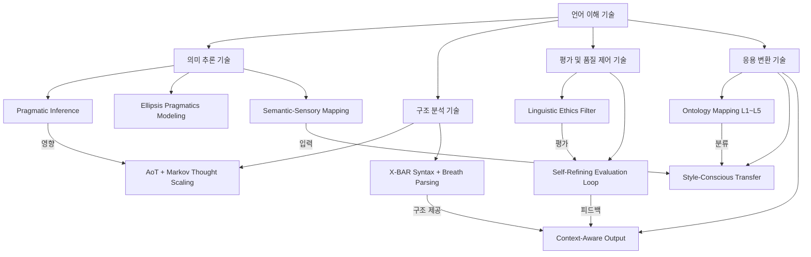

# 언어분석 10가지 기술 v1

## 핵심 온톨로지 모델

### 핵심 요약:

고종석 문체의 특성을 10가지 전문 기술로 체계화한 온톨로지 모델입니다. 이 시스템은 언어를 단순한 기호가 아닌 감각과 리듬, 윤리가 통합된 복합체로 분석합니다. 의미 추론 기술(Pragmatic Inference, Ellipsis Modeling)은 명시적/암시적 의미를 파악하고, 구조 분석 기술(AoT, X-BAR Syntax)은 언어의 사고 단위와 호흡 패턴을 분석합니다. 이를 Semantic-Sensory Mapping으로 감각 차원에 매핑하고, 윤리적 균형을 검증한 후, 자기평가 루프를 통해 지속적으로 개선합니다. 최종적으로 5단계 지식 계층 분류를 거쳐 문체의 핵심을 보존하며 다양한 맥락에 최적화된 출력을 생성합니다. 이 통합 시스템은 작가 스타일 모방, 문학적 텍스트 분석, 고급 콘텐츠 생성 등에 응용 가능합니다.

### 문서에 명시된 10개의 전문 기술이 접목되어 있습니다:

{

- Pragmatic Inference (의미 구조 분석)
- AoT + Markov Thought Scaling (사고 원자화)
- Semantic-Sensory Mapping (감각 기반 의미 매핑)
- X-BAR Syntax + Breath Parsing (문장 구조와 호흡 분석)
- Linguistic Ethics Filter (언어 윤리 평가)
- Ellipsis Pragmatics Modeling (생략 의미 추론)
- Self-Refining Evaluation Loop (자기 평가 루프)
- Ontology Mapping (L1~L5) (지식 계층 분류)
- Style-Conscious Transfer (문체 보존 변환)
- Context-Aware Output (맥락 기반 출력 최적화) }

### 1. 개념 계층 구조

```
언어 이해 기술
├── 의미 추론 기술
│   ├── Pragmatic Inference (의미 구조 분석)
│   ├── Ellipsis Pragmatics Modeling (생략 의미 추론)
│   └── Semantic-Sensory Mapping (감각 기반 의미 매핑)
├── 구조 분석 기술
│   ├── AoT + Markov Thought Scaling (사고 원자화)
│   └── X-BAR Syntax + Breath Parsing (문장 구조 분석)
├── 평가 및 품질 제어 기술
│   ├── Linguistic Ethics Filter (언어 윤리 평가)
│   └── Self-Refining Evaluation Loop (자기 평가 루프)
└── 응용 변환 기술
    ├── Ontology Mapping (L1~L5) (지식 계층 분류)
    ├── Style-Conscious Transfer (문체 보존 변환)
    └── Context-Aware Output (맥락 기반 출력 최적화)

```

### 2. 핵심 개념 및 관계



## 구조화된 온톨로지 표현

### 1. 개념(Concepts)

```json
{
  "concepts": [
    {"id": "C1", "name": "Pragmatic Inference", "definition": "문장의 표층 의미와 심층적 의도/정서/관계 맥락을 분리 및 추론하는 기술"},
    {"id": "C2", "name": "AoT + Markov Thought Scaling", "definition": "복잡한 사고를 이해 가능한 단위로 쪼개어 의미 단위로 구조화하는 기술"},
    {"id": "C3", "name": "Semantic-Sensory Mapping", "definition": "단어의 감각적 계열을 분류하여 '몸으로 읽는 문장'을 재현 가능하게 하는 기술"},
    {"id": "C4", "name": "X-BAR Syntax + Breath Parsing", "definition": "문장을 논리 구조가 아닌 '호흡 단위'로 해석하고 생성할 수 있게 하는 기술"},
    {"id": "C5", "name": "Linguistic Ethics Filter", "definition": "문장의 윤리적 태도를 평가하여 감정의 강요, 단정, 강한 평가어 사용 여부를 판단하는 기술"},
    {"id": "C6", "name": "Ellipsis Pragmatics Modeling", "definition": "생략된 정보/문맥/감정의 의미를 복원하거나 침묵 자체의 서사적 힘을 해석하는 기술"},
    {"id": "C7", "name": "Self-Refining Evaluation Loop", "definition": "생성된 문장의 감정-정보 균형, 리듬 붕괴, 수사 과잉 여부를 점검하고 수정하는 기술"},
    {"id": "C8", "name": "Ontology Mapping (L1~L5)", "definition": "생성된 문장을 철학(L1), 문체(L2), 수사(L3), 윤리(L4), 응용(L5) 중 어디에 귀속할지 분류하는 기술"},
    {"id": "C9", "name": "Style-Conscious Transfer", "definition": "고종석 문체의 핵심 요소를 보존하면서 장르를 변경하는 기술"},
    {"id": "C10", "name": "Context-Aware Output", "definition": "고맥락 처리, 리듬 정렬, 침묵과 윤리의 균형을 고려하여 최종 출력 문장을 완성하는 기술"},
    {"id": "C11", "name": "의미 추론 기술", "definition": "언어의 직접적 의미를 넘어 함축된 의도, 감정, 맥락을 파악하는 기술 그룹"},
    {"id": "C12", "name": "구조 분석 기술", "definition": "언어의 구조적 측면을 분석하여 의미 단위와 리듬을 파악하는 기술 그룹"},
    {"id": "C13", "name": "평가 및 품질 제어 기술", "definition": "생성된 언어의 윤리적, 질적 측면을 평가하고 개선하는 기술 그룹"},
    {"id": "C14", "name": "응용 변환 기술", "definition": "분석된 언어 지식을 다양한 형태로 변환하고 출력하는 기술 그룹"}
  ]
}

```

### 2. 관계(Relationships)

```json
{
  "relationships": [
    {"id": "R1", "source": "C11", "target": "C1", "type": "포함", "label": "하위기술"},
    {"id": "R2", "source": "C11", "target": "C6", "type": "포함", "label": "하위기술"},
    {"id": "R3", "source": "C11", "target": "C3", "type": "포함", "label": "하위기술"},
    {"id": "R4", "source": "C12", "target": "C2", "type": "포함", "label": "하위기술"},
    {"id": "R5", "source": "C12", "target": "C4", "type": "포함", "label": "하위기술"},
    {"id": "R6", "source": "C13", "target": "C5", "type": "포함", "label": "하위기술"},
    {"id": "R7", "source": "C13", "target": "C7", "type": "포함", "label": "하위기술"},
    {"id": "R8", "source": "C14", "target": "C8", "type": "포함", "label": "하위기술"},
    {"id": "R9", "source": "C14", "target": "C9", "type": "포함", "label": "하위기술"},
    {"id": "R10", "source": "C14", "target": "C10", "type": "포함", "label": "하위기술"},
    {"id": "R11", "source": "C1", "target": "C2", "type": "인과", "label": "입력제공"},
    {"id": "R12", "source": "C3", "target": "C9", "type": "인과", "label": "데이터제공"},
    {"id": "R13", "source": "C4", "target": "C10", "type": "인과", "label": "구조제공"},
    {"id": "R14", "source": "C5", "target": "C7", "type": "인과", "label": "평가기준제공"},
    {"id": "R15", "source": "C7", "target": "C10", "type": "인과", "label": "피드백제공"},
    {"id": "R16", "source": "C8", "target": "C9", "type": "인과", "label": "분류정보제공"},
    {"id": "R17", "source": "C6", "target": "C10", "type": "인과", "label": "생략의미제공"},
    {"id": "R18", "source": "C9", "target": "C10", "type": "인과", "label": "스타일정보제공"}
  ]
}

```

### 3. 속성(Properties)

```json
{
  "properties": [
    {"id": "P1", "concept": "C1", "name": "이론근거", "value": "Sperber & Wilson의 Relevance Theory, Grice의 협동 원칙"},
    {"id": "P2", "concept": "C1", "name": "작동방식", "value": "말하는 자의 입장, 듣는 자의 기대, 생략된 감정을 고려하여 의도적 침묵과 간접 발화를 감지"},
    {"id": "P3", "concept": "C2", "name": "이론근거", "value": "Simon's Bounded Rationality Model, Markov Chain in Language Modeling"},
    {"id": "P4", "concept": "C2", "name": "작동방식", "value": "문장을 '중심 질문'→'감각/예시/확장'→'귀결'의 흐름으로 분리, Markov 방식으로 다음 흐름 예측"},
    {"id": "P5", "concept": "C3", "name": "이론근거", "value": "Lakoff & Johnson의 Metaphors We Live By, Embodied Cognition"},
    {"id": "P6", "concept": "C3", "name": "작동방식", "value": "단어별로 감각 태그 부여, 감각 교차 동시 해석"},
    {"id": "P7", "concept": "C4", "name": "이론근거", "value": "Jackendoff의 X-bar 이론, Prosodic Phonology"},
    {"id": "P8", "concept": "C4", "name": "작동방식", "value": "문장을 X-BAR 구문구조로 분석해 핵심 의미 블록 식별, 호흡 단위 산출"},
    {"id": "P9", "concept": "C5", "name": "이론근거", "value": "Critical Discourse Analysis (Fairclough), 고종석의 문장 철학"},
    {"id": "P10", "concept": "C5", "name": "작동방식", "value": "감탄사/형용사/확정 어미 비율 분석, 강요 표현 감지"},
    {"id": "P11", "concept": "C6", "name": "이론근거", "value": "Halliday의 문맥론적 언어 기능, 정중함 이론(Brown & Levinson)"},
    {"id": "P12", "concept": "C6", "name": "작동방식", "value": "문장에서 생략된 주체/대상/정서를 복원, 생략을 표현 전략으로 인식"},
    {"id": "P13", "concept": "C7", "name": "이론근거", "value": "Metacognitive Loop (Cox), LLM의 Chain-of-Thought + Self-Consistency"},
    {"id": "P14", "concept": "C7", "name": "작동방식", "value": "생성 후 사후 평가 루프 실행, 체크리스트 기준에 따라 수정"},
    {"id": "P15", "concept": "C8", "name": "이론근거", "value": "Ontological Semantics (Nirenburg & Raskin), GPTs의 Knowledge Structuring"},
    {"id": "P16", "concept": "C8", "name": "작동방식", "value": "문장의 내용, 구조, 목적을 분석, 5계층 온톨로지 트리 구조와 연결"},
    {"id": "P17", "concept": "C9", "name": "이론근거", "value": "Style Transfer in NLP (Shen et al.), Discourse Preservation"},
    {"id": "P18", "concept": "C9", "name": "작동방식", "value": "고종석 리듬 사전 + 감각 매핑 표 기반, 장르별 출력을 위한 스타일 보존 룰 적용"},
    {"id": "P19", "concept": "C10", "name": "이론근거", "value": "Contextualized Language Modeling, 문학적 담론 구성 이론"},
    {"id": "P20", "concept": "C10", "name": "작동방식", "value": "리듬 구조와 감각 필터 최종 적용, 종결 구조 평가(열린 문장/여운 있는 문장)"}
  ]
}

```

## 시스템 다이내믹스 요소

```json
{
  "system_elements": [
    {"id": "S1", "type": "Stock", "name": "문장 분석 깊이", "initial_value": "사용자 입력 문장의 복잡성에 따라 다름"},
    {"id": "S2", "type": "Stock", "name": "감각적 표현 풍부도", "initial_value": "초기 입력에 따라 결정"},
    {"id": "S3", "type": "Stock", "name": "생성 문장 윤리성", "initial_value": "중립"},
    {"id": "S4", "type": "Stock", "name": "출력 문장 품질", "initial_value": "기본 GPT 수준"},
    {"id": "F1", "type": "Flow", "name": "의미 분석 강화", "affects": "S1", "direction": "in"},
    {"id": "F2", "type": "Flow", "name": "감각 매핑 적용", "affects": "S2", "direction": "in"},
    {"id": "F3", "type": "Flow", "name": "윤리 필터링", "affects": "S3", "direction": "in"},
    {"id": "F4", "type": "Flow", "name": "품질 개선", "affects": "S4", "direction": "in"},
    {"id": "F5", "type": "Flow", "name": "품질 저하", "affects": "S4", "direction": "out"}
  ],
  "feedback_loops": [
    {
      "id": "L1",
      "type": "R",
      "elements": ["C1", "C2", "C6", "S1"],
      "mechanism": "심층적 의미 추론이 강화될수록 더 많은 맥락 정보가 발견되고, 이는 다시 더 깊은 의미 추론을 가능하게 함"
    },
    {
      "id": "L2",
      "type": "B",
      "elements": ["C5", "C7", "S3", "S4"],
      "mechanism": "윤리 필터가 문제점을 발견하면 자기 평가 루프가 작동하여 품질 균형을 조정함"
    },
    {
      "id": "L3",
      "type": "R",
      "elements": ["C3", "C9", "S2", "S4"],
      "mechanism": "감각 매핑이 풍부해질수록 스타일 전이 품질이 높아지고, 이는 더 풍부한 감각 표현을 유도함"
    }
  ],
  "leverage_points": [
    {
      "id": "LP1",
      "element": "C7",
      "potential_impact": "high",
      "description": "자기 평가 루프는 품질 제어의 핵심으로, 이를 통해 전체 시스템의 출력 품질을 크게 향상시킬 수 있음"
    },
    {
      "id": "LP2",
      "element": "C3",
      "potential_impact": "medium",
      "description": "감각 기반 매핑은 문체의 고유성을 결정하는 중요 요소로, 이를 조정하여 특정 작가 스타일 모방 가능"
    },
    {
      "id": "LP3",
      "element": "C8",
      "potential_impact": "medium",
      "description": "온톨로지 매핑을 통해 지식 계층을 조정함으로써 다양한 응용 분야로의 확장 가능"
    }
  ]
}

```

## 핵심 추론 및 의사결정 지원 모델

### 1. 증거 기반 추론

이 시스템은 다음과 같은 추론 메커니즘을 포함합니다:

1. **언어 의미 추론 (Pragmatic Inference)**
    - 표면적 언어 표현에서 심층적 의도와 맥락을 추론
    - 협동 원칙과 관련성 이론에 기반한 함축 의미 도출
    - 발화자-청자 관계 및 상황 맥락 고려
2. **생략 의미 복원 (Ellipsis Pragmatics)**
    - 명시적으로 표현되지 않은 내용의 의미 복원
    - 의도적 침묵과 생략의 수사적 효과 분석
    - 문화적 맥락에 따른 비명시적 소통 규칙 적용
3. **감각-개념 연결 추론 (Sensory-Semantic Mapping)**
    - 추상 개념의 감각적 기반 추론
    - 언어 표현의 신체적 경험 연결성 파악
    - 감각 교차와 은유의 인지적 처리

### 2. 불확실성 처리 모델

본 시스템은 다음과 같은 불확실성 처리 기법을 활용합니다:

1. **자기 평가 루프 (Self-Refining Evaluation)**
    - 생성된 출력의 품질에 대한 확률적 평가
    - 다양한 품질 지표에 따른 신뢰도 산출
    - 임계값 기반 개선 결정
2. **맥락 의존성 모델링 (Context-Dependent Modeling)**
    - 다양한 해석 가능성의 병렬 처리
    - 맥락에 따른 해석 가중치 조정
    - 다중 해석 가능성의 동시 유지

## 통합 워크플로우

```
[입력 텍스트]
      ↓
1. 의미 추론 레이어 (Pragmatic Inference + Ellipsis + Sensory Mapping)
      ↓
2. 구조 분석 레이어 (AoT + X-BAR Parsing)
      ↓
3. 평가 레이어 (Ethics Filter + Self-Evaluation)
      ↓
4. 온톨로지 매핑 (L1~L5 분류)
      ↓
5. 스타일 변환 (Style Transfer)
      ↓
6. 최종 출력 최적화 (Context-Aware Output)
      ↓
[최종 텍스트 출력]

```

## 주요 인사이트 및 응용 방안

### 핵심 인사이트

1. **언어의 다차원성 구조화**
    - 이 온톨로지는 언어를 표면적 구조, 의미적 층위, 감각적 차원, 윤리적 측면 등 다차원적으로 분석하고 구조화하는 프레임워크를 제공합니다.
    - 특히 "고종석 문체"라는 특정 작가의 문체적 특성을 형식화하여 구조적으로 이해하고 응용할 수 있는 틀을 제시합니다.
2. **감각-의미 연결의 중요성**
    - 언어의 의미가 단순한 기호적 표현이 아닌 신체적 감각 경험과 연결되어 있다는 체화된 인지 이론을 실제 텍스트 분석에 적용합니다.
    - 이는 보다 풍부하고 생생한 텍스트 생성의 기반이 됩니다.
3. **윤리적 차원의 통합**
    - 언어 표현의 윤리적 측면(강요, 단정, 평가 등)을 명시적으로 고려하는 체계를 구축함으로써, 책임 있는 텍스트 생성의 기준을 제시합니다.
    - 이는 AI 생성 콘텐츠의 사회적 영향을 고려한 중요한 접근법입니다.

### 응용 방안

1. **작가 스타일 모방 시스템**
    - 특정 작가의 문체적 특성을 구조화하여 다양한 주제와 장르에 적용할 수 있는 시스템 개발
    - 교육용 콘텐츠 생성 및 창의적 글쓰기 지원 도구로 활용
2. **문학적 텍스트 분석 도구**
    - 문학 작품의 감각적, 리듬적, 구조적 특성을 자동으로 분석하는 도구
    - 문학 연구 및 비평을 위한 객관적 데이터 제공
3. **고급 콘텐츠 생성 시스템**
    - 감각적으로 풍부하고 윤리적으로 균형 잡힌 고품질 텍스트 자동 생성
    - 마케팅, 교육, 엔터테인먼트 등 다양한 분야에 활용 가능
4. **언어 치료 및 교육 도구**
    - 감각, 리듬, 호흡을 고려한 언어 교육 및 치료 도구 개발
    - 언어 발달 장애 진단 및 치료에 활용
5. **문화간 커뮤니케이션 지원**
    - 문화적 맥락과 비명시적 소통 방식을 고려한 번역 및 문화 간 커뮤니케이션 지원 도구
    - 국제적 비즈니스 및 외교 분야에서 활용 가능

이 온톨로지 모델은 언어의 다차원적 측면을 종합적으로 고려하여, 단순한 정보 전달을 넘어 감각, 윤리, 리듬이 통합된 풍부한 언어 처리 시스템의 기반을 제공합니다.